<h1 align="center">Hi 👋, I'm Subham Roy</h1>
<h3 align="center">A passionate Vibe coder and Backend developer</h3>

  
  
  
  
  
  

 

<h3><code>$ whoami --verbose</code></h3>
<table>
  <tr>
    <td valign="top"></td>
    <td valign="top"></td>
  </tr>
</table>

  

<h3><code>$ cat contributions.log</code></h3>

